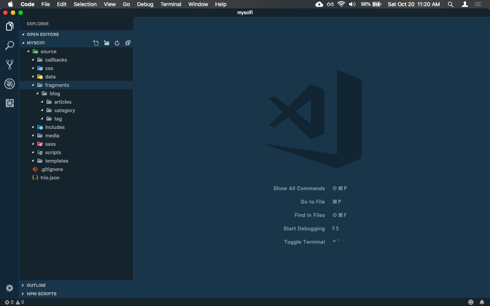
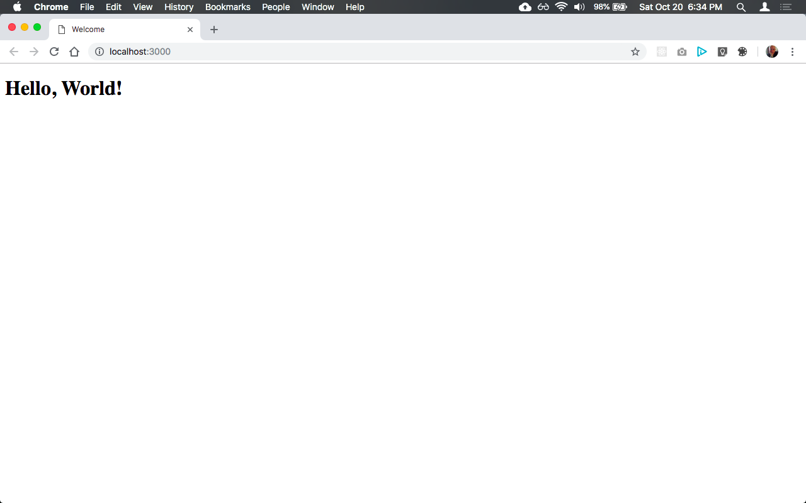

<!-- 
title: User Stories
template: default.html
appendToTarget: true
-->

# User Stories

* [ In the begining... ](#in-the-begining-)
* [ Hello, World! ](#hello-world-)
* Connecting pages with links
* Using front matter to customize pages
* Adding common content accross pages
* Blogging 

## In the begining...

Betty is a software developer at Carniverous Consulting. In her spare time she's also a sci-fi fanatic. She has been thinking about creating her own website dedicated to her passion for science fiction so she's done some research. Since she is a web developer she's already proficient in HTML, Markdown, CSS and JavaScript and she even used YAML front matter and knows some Node. She would like to use a static website generator that would allow her to leverage these skills but everything she's found so far requires lots of configuration, one JavaScript templating language or another, React or View in a few cases, and all this just to be able to generate static web pages. Betty thinks that's just rediculous so she puts her idea aside for a while.

One day Betty was checking her Twitter feed and noticed someone tweeting about a static site generator called Trio. What really grabbed her attention, though, was that the tweeter said that Trio only requires HTML, Markdown, CSS, JavaScript, something called Cheerio, and a sprinkle of YAML front matter, and almost no configuration to create static web pages.

Intriged by what she read, Betty installed Trio, which she learned is a Node package, globally on her 2009 late model white Macbook laptop. She's used other Node packages before so she felt quite comfortable doing that. The documentation said that after installing Trio she could run `trio new <path/to/folder/>` from the command line to create a new project. So Betty fired up her terminal application and ran `trio new myscifi`.

```
$ trio new myscifi
*** trio-new ***
*** The target folder is "myscifi"
*** Creating new project. Pleae wait...
*** myscifi created
```

Within moments she was informed that "myscifi" was created. Betty thought, "Wow, that was kind of fast!" Intriged again, Betty decided to open up her favorite code editor, VSCode, to explore what was created. She noticed one folder in the root of her project named `source` so she expanded it which revealed a number of child folders.



"Hmm, now what? I better check the docs to see what I should do next." Reading the docs Betty learned that to create a web page with Trio she needs to create a `page template` in the source/templates folder, which is an HTML file that defines the overall structure of a webpage and a `page fragment` in the source/fragments folder, which can be either an HTML file or a markdown file and which is used to create variants of a particular webpage using the same page template. Furthermore, Betty learned that every webpage requires these 2 things at a minim and that Trio merges their content together to create a webpage.

Intriged again, Betty decided to create the ubiquitous "Hello, World!" webpage thinking that if it takes her more than a few minutes, not including reading some docs, she'll dump Trio and continue her search for some other static site generator to use.

## Hello, World!

So Betty reads the docs about page fragments and learns that every one requires two front matter properties, `title` and `template`. The docs explained that "title" is used to assign a title to the webpage (after all, what would a webpage be if it didn't have a title) and that "template" is used to identify the page template in the source/templates folder that the page fragment is associated with. She also learned that front matter uses HTML comments as delimeters. Betty thought, "Oh, that's smart! Front matter wont break my markup formatting then."

Betty then creates a new file in the source/templates folder and names it `default.html`. She wasn't sure how Trio names the pages it actually generates or even where Trio saves them but she decided she will just keep going to find out.

Betty then uses Emmet to add some basic HTML markup to `default.html` to produce the following:

```html
<!DOCTYPE html>
<html lang="en">

<head>
    <meta charset="UTF-8">
    <meta name="viewport" content="width=device-width, initial-scale=1.0">
    <meta http-equiv="X-UA-Compatible" content="ie=edge">
    <title>Document</title>
</head>

<body>
    <main></main>
</body>

</html>
```

Looking at her page template content, Betty began wondering how Trio will know where to place the content from the page fragment she's about to create in the page template she just created. Reading the docs she learns that all she has to do to instruct Trio where she wants the page framents comment to go is to add a `data-trio-fragment` attribute to an HTML tag. So after doing so, the `default.html` page template now looks like the following:

```html
<!DOCTYPE html>
<html lang="en">

<head>
    <meta charset="UTF-8">
    <meta name="viewport" content="width=device-width, initial-scale=1.0">
    <meta http-equiv="X-UA-Compatible" content="ie=edge">
    <title>Document</title>
</head>

<body>
    <main data-trio-fragment></main>
</body>

</html>
```

Then Betty creates a new file in the source/fragments folder, names it `index.md`, and adds the required front matter and the markdown content to it to produce the following:

```markdown
<!-- 
title: Welcome
template: default.html
-->
# Hello, World!
```

Betty's now thinking, "OK, I've created the page template and the page fragment, so what do I have to do now to actually generate the website?" Betty goes back to the docs and learns that all she has to do is run the command  `trio build` in the terminal and Trio will create a new folder named `public` in which is the generated website. So Betty opens her terminal again, makes sure that the current directory is `myscifi`, runs the `trio build` command and gets the following feedback:

```
$ trio build
building public folder for development
```

Wondering why it said "for development" Betty goes back to the docs and learns that Trio also has something called a `release build` but that she will investigate that later as right now she just wants to know what the command she just ran actually did.

So Betty now goes back to VSCode and notices that there is now a new folder named `public` in the project explorer and in it is a file named `index.html` as well as three empty folders - `css`, `media`, and `scripts`. Curious as to what Trio actually generated for the `index.html` file, she opens that up in an editor window as sees the following:

```html
<!DOCTYPE html>
<html lang="en">

<head>
    <meta charset="UTF-8">
    <meta name="viewport" content="width=device-width, initial-scale=1.0">
    <meta http-equiv="X-UA-Compatible" content="ie=edge">
    <title>Welcome</title>
</head>

<body>
    <h1 id="hello-world-">Hello, World!</h1>

</body>

</html>html
```

"Wow! That was really easy and I didn't have to configure anything and look, my output!" Betty said to herself. Then she noticed that the `<main></main>` tag in the page template was missing, having been replaced by the content from the page fragment. Wondering if there's a way to tell Trio, "Hey, Trio! Don't replace the tag I added the `data-trio-fragment` attribute to. I want you to append the content to that tag instead." So back to the docs she goes and quicly learns that all she has to do is add `appendToTarget: true` to the front matter in the page fragment and Trio will then append the content to the tag instead of replacing it. Betty goes back and edits source/fragments/index.md which now looks like the following:

```markdown
<!-- 
title: Welcome
template: default.html
appendToTarget: true
-->
# Hello, World!
```

Betty then goes back to the terminal and runs the build command `trio build` again and when it completes she then inspects the contents of the generated public/index.html file in VSCode and is very happy to see that Trio did indeed append the content to the main tag and that the file now looks like the following:

```html
<!DOCTYPE html>
<html lang="en">

<head>
    <meta charset="UTF-8">
    <meta name="viewport" content="width=device-width, initial-scale=1.0">
    <meta http-equiv="X-UA-Compatible" content="ie=edge">
    <title>Welcome</title>
</head>

<body>
    <main data-trio-fragment="">
        <h1 id="hello-world-">Hello, World!</h1>
    </main>

</body>

</html>
```

"Awesome! But how do I run what Trio just created for me in the browser?" Betty though to herself. So Betty goes back to the docs and learns that to actually run the website in the browser all she has to do is run `trio serve` from the command line and that will not only launch the website in the browser but will also refresh the browser anytime she changes something in the source folder.

Once again, Betty opens up her terminal applications, makes sure that the current directory is `myscifi` and runs the command `trio serve` which produces the following output (some of which is abreviated as it can be quite verbose):

```
launching browser, serving application and watching source folder for changes
Starting chokidar
Now watching:
 { '/Users/Betty/myscifi/source':
   [ 'callbacks',
     'css',
     'data',
     'fragments',
     'includes',
     'media',
     'sass',
     'scripts',
     'templates' ]}
Starting browser-sync
[Browsersync] Access URLs:
 ------------------------------------
       Local: http://localhost:3000
    External: http://192.168.1.4:3000
 ------------------------------------
          UI: http://localhost:3001
 UI External: http://192.168.1.4:3001
 ------------------------------------
[Browsersync] Serving files from: ./public
```

and lo and behold, her browser suddenly appeared and was pleased to see that her page rendered correctly.



Betty was thrilled!