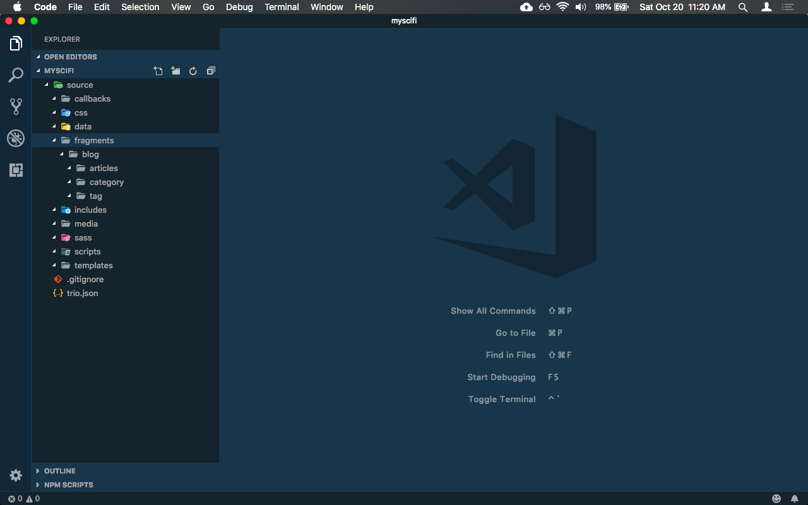

<!--
title: In The Begining
template: default.html
callback: breadcrumbs.js
breadcrumbs:
    - <a data-trio-link href="/">Home</a>
    - <a data-trio-link href="/userstories">User Stories</a>
-->

# In The Begining...

Follow along with Betty as she learns the basics of using Trio.

* [ Introduction ](#introduction)
* [ Installing Trio](#installing-trio)
* [ Creating a new project](#creating-a-new-project)
* [ Hello, World! ](#hello-world-)
* [ Connecting pages with links ](#connecting-pages-with-links)
* [ Using JavaScript and metadata to customize pages ](#using-javascript-and-metadata-to-customize-pages)
* Using includes to add common content across pages
* Blogging 

## Introduction

Betty is a software developer at Carnivorous Consulting. In her spare time she's also a sci-fi fanatic. She's been thinking about creating her own website dedicated to her passion for science fiction and she's already done some research on tools she might want to use to create it. Since she is a web developer she's already proficient in HTML, Markdown, CSS and JavaScript and she even used YAML front matter, Node and NPM. She would like to use a static website generator that would allow her to leverage these skills but everything she's found so far requires a lot of obtuse configuration, one type of templating language or another, even React or View in a few cases, and all this just to be able to generate static web pages. Betty thinks that's just ridiculous so she puts her idea aside for a while.

One day Betty was checking her Twitter feed and noticed someone tweeting about a static site generator called Trio. What really grabbed her attention, though, was that the tweeter said that Trio only requires the developer to use HTML, Markdown, CSS, JavaScript, something called Cheerio, and a sprinkle of YAML front matter, and almost zero configuration to create static web pages. The tweeter also mentioned that Trio had excellent support for creating blogs.

## Installing Trio

Intrigued, Betty used `NPM` to install Trio, a `Node` package, globally on her 2009 late model white Macbook laptop. She's used other Node packages before, so she felt comfortable doing that:

```shell
npm i -g @4awpawz/trio
```

## Creating A New Project

The documentation said that after installing Trio she could run `trio new <path/to/folder/>` from the command line to create a new project. So Betty fired up her terminal application, made her development folder the current working directory, and ran `trio new myscifi`.

```shell
$ trio new myscifi
*** trio-new ***
*** The target folder is "myscifi"
*** Creating new project. Please wait...
*** myscifi created
```

After only a few moments the command completed and then Betty opened up her favorite code editor, VSCode, to explore what was created. She noticed that there was only one folder in the root of her project, named `source`, so she expanded it which revealed a number of child folders.



Betty thought, "OK, so how do I create web pages? Maybe I should check the docs to find out." So Betty reads the docs and discovers that to create a web page she should:

1. Create a `page template`, which is an HTML file that defines the overall structure of a web page, in the source/templates folder.
2. Create a `page fragment`, which is either an HTML file or a markdown file that is used to create variations of a particular web page using the same page template, in the source/fragments folder.

Betty also discovered that Trio "merges" the content from page fragments and page templates together to produce webpages.

Betty decides to create the ubiquitous "Hello, World!" web page thinking that if it takes her more than a few minutes, not including reading some docs, she'll dump Trio and continue her search for some other static site generator to use.

## Hello, World!

So Betty reads the docs about page fragments and learns that every one requires two front matter properties, `title` and `template`. The docs explain that "title" is used to assign a title to the web page (after all, what would a web page be if it didn't have a title) and "template" is used to identify the page template in the source/templates folder that the page fragment is associated with. She also learns that front matter uses HTML comments as delimiters and she thinks that's good because it means that front matter wont break her markup formatting.

Betty then creates a new file in the source/templates folder and names it `default.html`. She wasn't sure how Trio names the pages it actually generates or even where Trio saves them but she decided she will just keep going to find out.

Betty then uses Emmet to add some basic HTML markup to `default.html` to produce the following:

```html
<!DOCTYPE html>
<html lang="en">

<head>
    <meta charset="UTF-8">
    <meta name="viewport" content="width=device-width, initial-scale=1.0">
    <meta http-equiv="X-UA-Compatible" content="ie=edge">
    <title>Document</title>
</head>

<body>
    <main></main>
</body>

</html>
```

Looking at her page template content, Betty begins wondering where Trio will merge the content from the page fragment she's about to create in the page template she just created. Reading the docs she learns that all she has to do to instruct Trio where she wants the page fragment content to go is to add a `data-trio-fragment` attribute to an HTML tag. So after doing so, the `default.html` page template now looks like the following:

```html
<!DOCTYPE html>
<html lang="en">

<head>
    <meta charset="UTF-8">
    <meta name="viewport" content="width=device-width, initial-scale=1.0">
    <meta http-equiv="X-UA-Compatible" content="ie=edge">
    <title>Document</title>
</head>

<body>
    <main data-trio-fragment></main>
</body>

</html>
```

Then Betty creates another new file in the source/fragments folder, names it `index.md`, and adds the required front matter and some markdown content to produce the following:

```markdown
<!-- 
title: Welcome
template: default.html
-->
# Hello, World!
```

Betty goes back to the docs and learns that she should now run the command `trio build` in the terminal and that Trio will generate the website in a folder named `public`. So Betty opens her terminal app again, makes sure that the current directory is `myscifi`, and runs the `trio build` command:

```shell
$ trio build
building public folder for development
```

Wondering why the output says "building public folder for development" Betty goes back to the docs and learns that Trio also has something called a `release build` but she decides she will investigate that later as for right now she just wants to know what the `trio build` command actually did.

So Betty now goes back to VSCode and notices that there is now a new folder, named `public`, in the root folder of her project and in it is a file named `index.html` as well as three empty folders - `css`, `media`, and `scripts`.


Curious as to what Trio actually generated for the `index.html` file, she opens that up in an editor window and sees the following:

```html
<!DOCTYPE html>
<html lang="en">

<head>
    <meta charset="UTF-8">
    <meta name="viewport" content="width=device-width, initial-scale=1.0">
    <meta http-equiv="X-UA-Compatible" content="ie=edge">
    <title>Welcome</title>
</head>

<body>
    <h1 id="hello-world-">Hello, World!</h1>
</body>

</html>html
```

Betty notices that the `<main></main>` tag in the page template is missing from the generated page, having been replaced by the content from the page fragment. Wondering if there's a way to tell Trio to append the content to that tag instead she goes back to the docs and quickly learns that all she has to do is add `appendToTarget: true` to the front matter in the page fragment and Trio will then append the content to the tag instead of replacing it. Betty goes back and edits source/fragments/index.md, which now looks like the following:

```markdown
<!-- 
title: Welcome
template: default.html
appendToTarget: true
-->
# Hello, World!
```

Betty then goes back to the terminal, runs the command `trio build` again and inspects the contents of the generated public/index.html file in VSCode and is very happy to see that Trio did indeed append the page fragment's content to the main tag and that the generated file now looks like the following:

```html
<!DOCTYPE html>
<html lang="en">

<head>
    <meta charset="UTF-8">
    <meta name="viewport" content="width=device-width, initial-scale=1.0">
    <meta http-equiv="X-UA-Compatible" content="ie=edge">
    <title>Welcome</title>
</head>

<body>
    <main data-trio-fragment="">
        <h1 id="hello-world-">Hello, World!</h1>
    </main>

</body>

</html>
```

Wondering how to run her newly created website in the browser, Betty goes back to the docs and learns that all she has to do is run `trio serve` from the command line and Trio will not only launch the website in the browser but will also refresh the browser anytime she changes something in the source folder.

Once again, Betty opens up her terminal applications, makes sure that the current directory is `myscifi` and runs the command `trio serve`, which produces the following output (some of which is abbreviated as it can be quite verbose):

```shell
launching browser, serving application and watching source folder for changes
Starting chokidar
Now watching:
 { '/Users/Betty/myscifi/source':
   [ 'callbacks',
     'css',
     'data',
     'fragments',
     'includes',
     'media',
     'sass',
     'scripts',
     'templates' ]}
Starting browser-sync
[Browsersync] Access URLs:
 ------------------------------------
       Local: http://localhost:3000
    External: http://192.168.1.4:3000
 ------------------------------------
          UI: http://localhost:3001
 UI External: http://192.168.1.4:3001
 ------------------------------------
[Browsersync] Serving files from: ./public
```

and lo and behold, her browser suddenly appeares and Betty is pleased to see that her page rendered correctly.


Betty then adds a new line of markdown to the page fragment, which now looks like the following:

```html
<!-- 
title: Welcome
template: default.html
appendToTarget: true
-->
# Hello, World!

## This isn't just la di da!
```

and notices that her page in the browser was refreshed to reflect the change she made:


Betty is thrilled that she was able to install Trio and in just a few short minutes easily generate a website, even if it's only the ubiquitous "hello world" sort of thing.

## Connecting pages with links

Having created a website with a default index page was certainly easy but Betty wondered how to add more pages to her site and how to link one page to another. Betty learns from reading the docs that `internal links` (i.e. links from one page to another page hosted by the website) should always start with a forward slash followed by the path to the linked file. For example, when running your website locally using the `trio serve` command, the URL address to your site's root index.html file would be "/", i.e `<a href="/">...</>`.

Betty also learns from reading the docs that Trio generates `permalinks` for every page based on (with the exception of blog related pages, which Trio generates differently) the name of the page fragment. So, for example, if a non blog related page fragment is named source/fragments/about.md, Trio will generate the page as public/about/index.html and its URL would be "/about". Betty likes that Trio generates permalinks like that because they are very clean and SEO friendly and easy to share on social media and all that.

So Betty goes back to her project in VSCode and creates a new page fragment named source/fragments/about.md, which looks like the following:

```html
<!-- 
title: About
template: default.html
appendToTarget: true
-->
# About
```

She also notices that Trio recognized that she added a new page fragment to the project and has already generated the new About page in the public folder:


Betty then adds a link to the new about page in page fragment source/index.md, which now looks like the following:

```html
<!-- 
title: Welcome
template: default.html
appendToTarget: true
-->
# Hello, World!

## This isn't just la di da!

### [About](/about)
```

Betty notices that the browser has already refreshed her index page, which now looks like the following:


She then clicks the `About` link on the page and the browser renders her About page:


## Using JavaScript and metadata to customize pages

